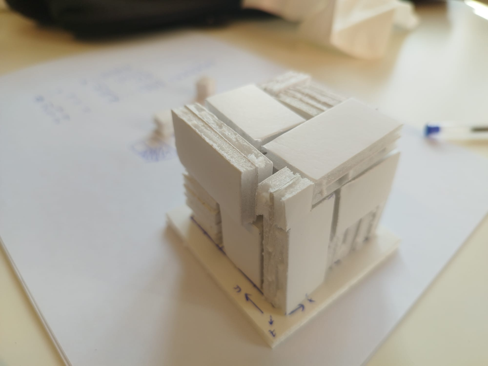
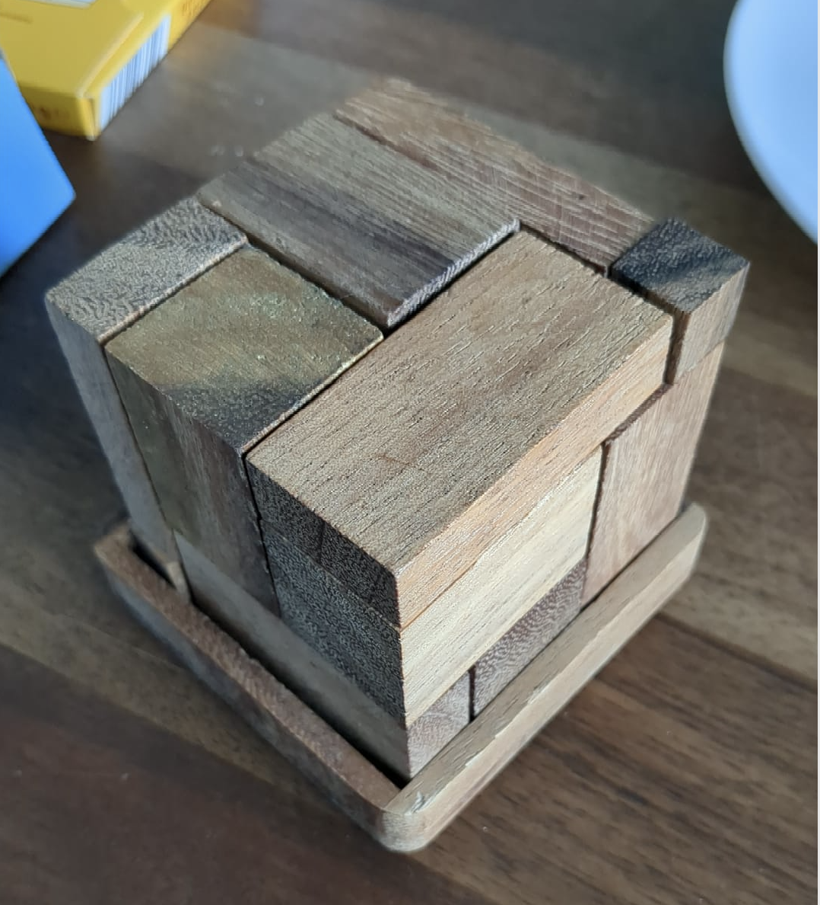
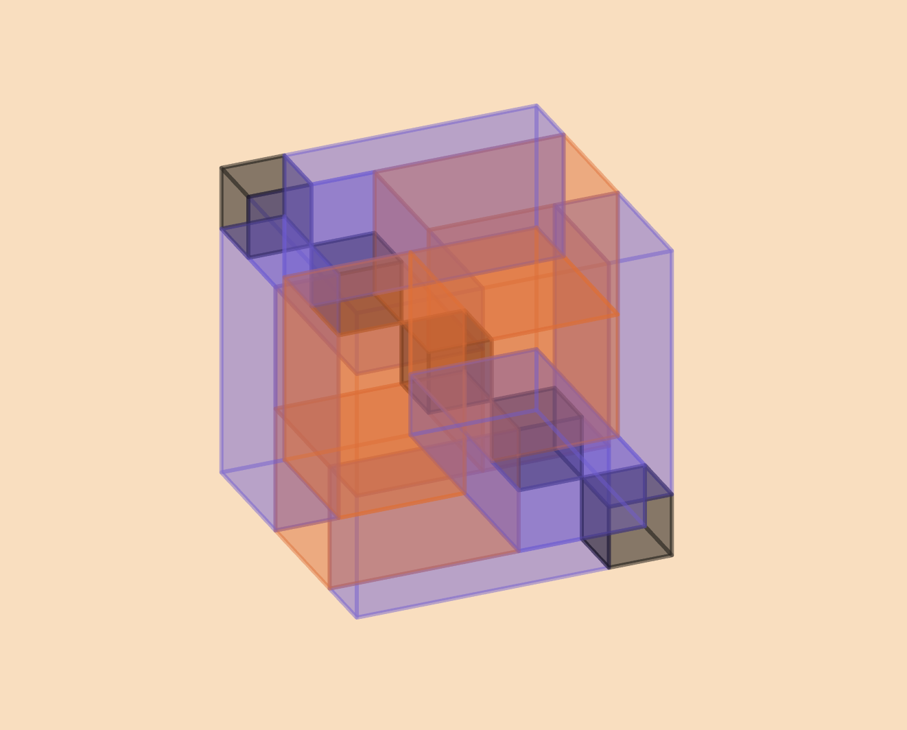

# Cube puzzle

## What's this?

My sister had this wooden logic puzzle laying on her table last time I visited, and I wasn't able to solve it, so I coded a search algorithm instead :)

The problem statement: try to fill a 5x5x5 cube with these blocks:

- six "big" 2x2x3 blocks
- six "flat" 1x2x4 blocks
- five "pixel" 1x1x1 blocks

For an interactive vizualisation, see:

https://codepen.io/Kelley-van-Evert/full/azbQJqz

